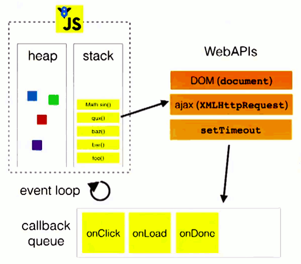

# 什么是promise


promise就是个构造函数，参数为一个函数</br>
构造函数一般使用其实例进行操作，如何得到一个构造函数的实例呢？</br>
1、new Promise（参数:函数）；</br>
2、参数为一个函数，这个函数同样也有两个参数 resolve reject，这两个参数也是函数</br>
resolve执行后返回promise的成功状态，</br>
reject执行后返回promise的错误状态</br>

### 基本使用形式：
```
var p = new Promise(function(resolve,reject){
    console.log("结果");
    resolve("结果")
    })
//以上代码将一段同步代码封装成了一个promise实例,promise实例有两个三个状态
//peding   正在请求
//resolved 成功
//rejected 失败
//这个实例内部调用resolve，返回成功状态，并将结果通过resolve传递。

//传递出来的结果如何使用呢？
//下面的代码，通过调用promise实例上面的then方法来获得resolve传递的数据。
p.then(function(data){
    console.log(data)
    })
```
### 从上面的代码可以总结一下promise的特点:</br>

+ 只要一 new ，promise就执行了，并且得到一个promis实例
+ promis实例内部结果通过resolve进行传递
+ 通过调用promise实例的then方法获取resolve传递的结果;

一般用promise干什么呢？<br>
包装异步执行代码，将其转化为同步执行的样式,<br>
比方发送一个ajax常规方法:<br>

~~~
$.get("https://cnodejs.org/api/v1/topics?tab=share",function(data){
    console.log(data);
})
~~~

转化为Promise如下:

~~~
let p = new Promise((resolve,reject)=>{
    $.get("https://cnodejs.org/api/v1/topics?tab=share",function(data){
     resolve(data)
    })
});

p.then((data)=>{
    //执行代码逻辑
    console.log(data)
})
~~~
### 在实际开发中使用
但是一般在开发中一般不会把new Promise直接暴露在外面，而是封装成一个函数，上面代码修改如下：
~~~
function  fn(){
    let p = new Promise((resolve,reject)=>{
        $.get("https://cnodejs.org/api/v1/topics?tab=share",function(data){
            resolve(data)
        })
    });
    return p
}

fn().then((data)=>{
    console.log(data)
})
~~~


### 如何学习promise
根据作用需求/场景来学习,需求如下:<br>
比方一个页面加载进来，需要发送5个ajax请求，并需要把结果统一经行处理:
+ 首先大家按照大家已有的知识点来思考一下如何解决呢？<br>
代码如下：

~~~
$(function(){
    var arr = []
    $.get("https://cnodejs.org/api/v1/topics?tab=ask",function(data){
        arr.push(data);
        $.get("https://cnodejs.org/api/v1/topics?tab=job",function(data){
            arr.push(data);
            $.get("https://cnodejs.org/api/v1/topics?tab=good",function(data){
                arr.push(data);
                $.get("https://cnodejs.org/api/v1/topics?tab=share",function(data){
                    arr.push(data);
                        console.log(arr)
                })
            })
        })
    })
})
~~~
简称 回调地狱 
缺点耗费时间,看图说话：


创新一下，代码如下：
~~~
(function () {
    var count = 0;
    var arr = [];
    function handle() {
        if (count === 4) {
            console.log(arr);
        }
    }
    $.get("https://cnodejs.org/api/v1/topics?tab=good",function(data){
        arr.push(data);
        count++;
        handle()
    })
    $.get("https://cnodejs.org/api/v1/topics?tab=job",function(data){
        arr.push(data);
        count++;
        handle()
    })
    $.get("https://cnodejs.org/api/v1/topics?tab=share",function(data){
        arr.push(data);
        count++;
        handle()
    });
    $.get("https://cnodejs.org/api/v1/topics?tab=ask",function(data){
        arr.push(data);
        count++;
        handle()
    });

})();
~~~

但是这种依然有个缺点，得写监控函数，每次回调都会调用监控函数，耗费性能，还有其他方法吗？<br>
查看network 中的waterfall;<br>
<br>


### *Promise* 来了，用promise怎么实现呢？


代码如下：
~~~
$(function(){
    // 封装一个promise;将url提取出来;
    var  p  = function(url){
        return new Promise(function(resolve,reject){
            $.get(url,function(data){
            resolve(data);
            })
        })
    }
    Promise.all([
            p("https://cnodejs.org/api/v1/topics?tab=good"),
            p("https://cnodejs.org/api/v1/topics?tab=share"),
            p("https://cnodejs.org/api/v1/topics?tab=ask"),
            p("https://cnodejs.org/api/v1/topics?tab=job"),
        ]).then(function(result){
            console.log(result);
        })
})
~~~

waterfall图如下：<br>
<br>


有的时候有这样的需求,后面的ajax请求依赖前面的ajax请求必须按照顺序调动如何实现呢？<br>
前面的回调是一种解决方案，但是想避免回调地狱的写法用promise实现顺序调用呢？<br>

~~~
$(function(){
    // 封装一个promise;
    var  p  = function(url){
        return new Promise(function(resolve,reject){
            $.get(url,function(data){
            resolve(data);
            })
        })
    }
    var arr = []
    p("https://cnodejs.org/api/v1/topics?tab=ask")
    .then(function(data){
        arr.push(data);
        return p("https://cnodejs.org/api/v1/topics?tab=share")
    }).then(function(data){
        arr.push(data);
        return p("https://cnodejs.org/api/v1/topics?tab=ask")
    }).then(function(data){
        arr.push(data);
        return p("https://cnodejs.org/api/v1/topics?tab=good")
    }).then(function(data){
        arr.push(data);
        console.log(arr);
    })      
})
~~~

waterfall执行图：<br>
<br>


再看一个应用场景：<br>
请求多个资源,哪个接口先返回,就处理哪个接口的信息：<br>
一般应用的比较多的是分布式应用,举例子说明，<br>
四台 服务器分别位于 北京 上海 南京 郑州:画图说明<br>


这应用到一个race接口，将4.html的js代码改成如下：
~~~
$(function(){
    // 封装一个promise;
    var  p  = function(url){
        return new Promise(function(resolve,reject){
            $.get(url,function(data){
            resolve(data);
            })
        })
    }
    Promise.race([
            p("https://cnodejs.org/api/v1/topics?tab=good"),
            p("https://cnodejs.org/api/v1/topics?tab=share"),
            p("https://cnodejs.org/api/v1/topics?tab=ask"),
            p("https://cnodejs.org/api/v1/topics?tab=job"),
        ]).then(function(result){
            console.log(result);
        })
})
~~~

运行看结果，谁最先返回就打印谁的数据：<br>

再来看一个需求，发送一个请求,请求超时后返回特定信息如何实现：<br>
jquery版本：
~~~
$.ajax({
　　url:'https://cnodejs.org/api/v1/topics?tab=good',  //请求的URL
　　timeout : 1000, //超时时间设置，单位毫秒
　　type : 'get',  //请求方式，get或post
　　data :{},  //请求所传参数，json格式
　　dataType:'json',//返回的数据格式
　　success:function(data){ //请求成功的回调函数
　　　　alert("成功");
　　},
    error:function(){
        console.log("超时了")
    }
});

//设置timeout的时间，超时后触发error函数。
~~~
Promise版本如何实现呢？
+ 封装两个Promise
  * 一个promise里面封装ajax请求
  * 一个Promise封装定时器
+ 调用Promise类的race方法
+ 链式调用then方法获得执行结果。

注意：Promise.race的参数为一个数组，数组每一项都是promise实例对象。<br>
Promise.race的返回结果为一个Prmise实例，只不过这个实例只能是最先执行resolve的那个promise。
~~~
$(function(){
    // 封装一个promise;
    var  p  = function(url){
        return new Promise(function(resolve,reject){
            $.get(url,function(data){
            resolve(data);
            })
        })
    }


    var p2 = function(){
        return new Promise(function(resolve,reject){
            setTimeout(function(){
                resolve('请求超时了')
            },100)
        })
    }

    Promise.race([
            p("https://cnodejs.org/api/v1/topics?tab=good"),
            p2()
        ]).then(function(result){
            console.log(result);
        })
    })
~~~


###promise捕获错误的使用,作为了解
如何捕获promise的错误呢？在promise的调用链的最后调用catch函数,一旦promise调用链中有reject执行,promise就会终止执行直接进入catch函数,否则catch不会执行。

~~~
$(function(){
    // 封装一个promise;
    var  p  = function(url){
        return new Promise(function(resolve,reject){
            $.get(url,function(data){
            resolve(data);
            })
        })
    }


    // P2的另一种形态:
    // 如果是reject会直接跳到catch里面去，如果是resolve,会接着执行，不会跳跃
    var p2 = function(){
        return new Promise(function(resolve,reject){
            setTimeout(function(){
                reject("err");
            },100)
        })
    }

    Promise.race([
            p("https://cnodejs.org/api/v1/topics?tab=good"),
            p2()
        ]).then(function(result){
            console.log(result);
        }).then(function(){
            console.log("我运行了")
        }).catch(function(data){
            console.log(data);
        })
    })
~~~

### javascript的宏任务和微任务

看一道面试题:
~~~
setTimeout(function(){console.log('1')});
 
new Promise(function(resolve,reject){
    resolve();
    console.log('2');
}).then(function(){
    console.log('3')
});
 
console.log('4');
~~~

请问这段代码的执行结果是什么？<br>

回忆javascript的异步机制,如图:<br>


这张图不是很完整,在javascript中分为宏任务（macrotask）和微任务(micro-task);
宏任务（macrotask）包括 cript（整体代码）, setTimeout, setInterval, setImmediate, I/O, UI rendering<br>
micro-task: process.nextTick, Promises（这里指浏览器实现的原生 Promise）<br>;
